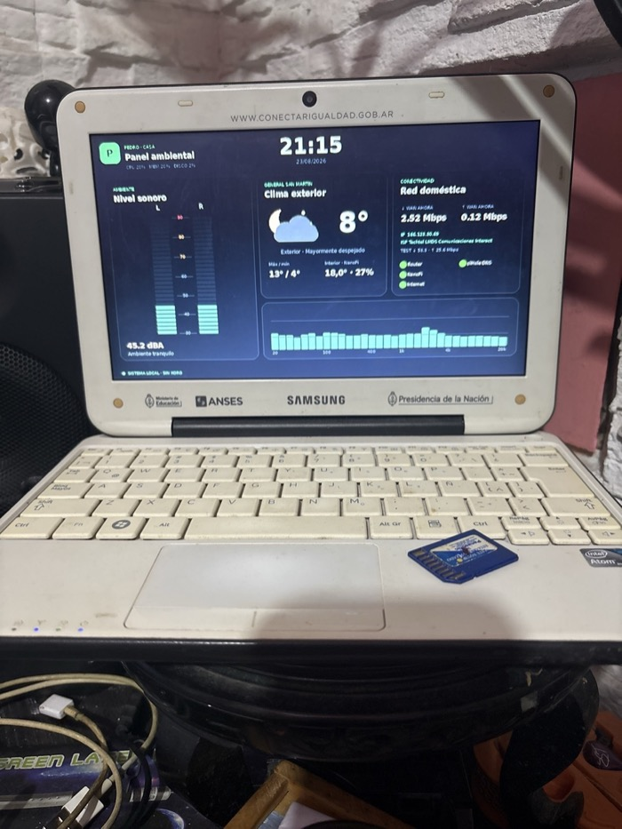
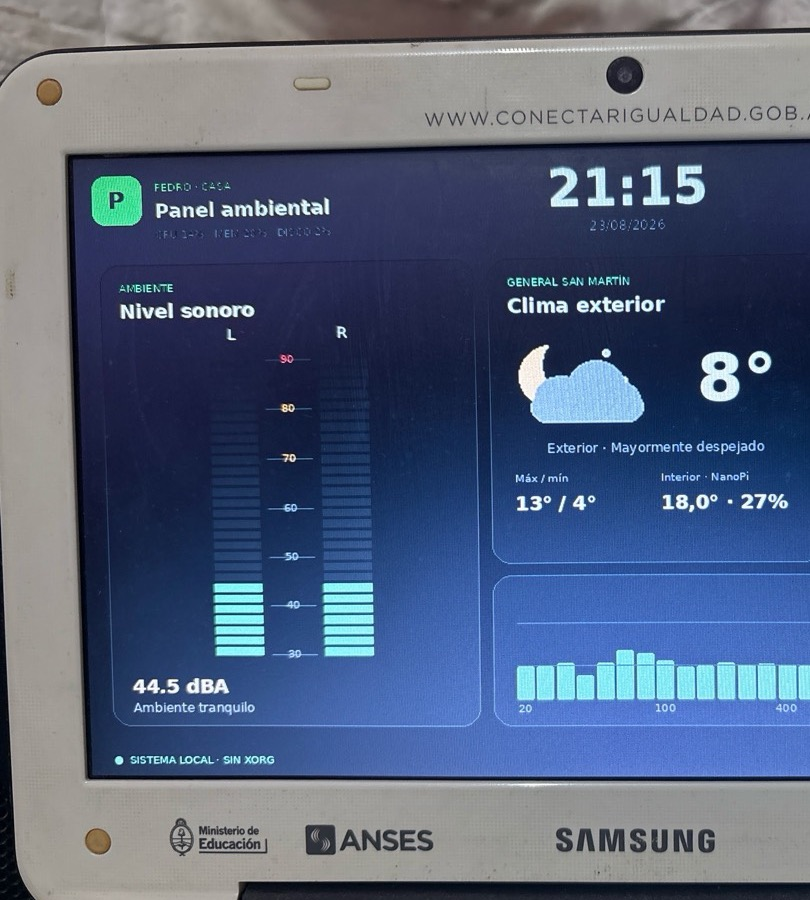

# Segunda Vida Dashboard

Un panel ambiental y de red para convertir una computadora antigua en un objeto útil, visible y administrable desde la red local.

Este proyecto nació recuperando una **netbook educativa del gobierno argentino**, una Samsung 100NZB / Intel Classmate PC con Atom, 2 GB de RAM, disco mecánico, pantalla 1024×600, micrófono y webcam. El hardware ya no era cómodo para navegación moderna ni procesamiento de audio profesional, pero todavía tenía todo lo necesario para funcionar las 24 horas como panel doméstico.

La solución no depende de ese modelo: puede usarse en netbooks, notebooks y PCs x86 antiguos que puedan ejecutar Debian y tengan una pantalla compatible con framebuffer Linux.

> Estado: proyecto funcional y en evolución.



La implementación original funciona sobre una netbook de **Conectar Igualdad** con Intel Atom y 2 GB de RAM. En lugar de descartar el equipo, se aprovechó su pantalla, micrófono, webcam, Wi‑Fi y almacenamiento para crear un panel doméstico autónomo.



## Qué muestra

- reloj de 24 horas;
- clima exterior mediante Open-Meteo;
- temperatura y humedad interior desde un sensor remoto opcional;
- nivel sonoro L/R aproximado en dBA;
- RTA de 31 bandas, de 20 Hz a 20 kHz;
- actividad WAN de un MikroTik opcional;
- IP pública, ISP y prueba periódica de conexión;
- disponibilidad de hasta seis equipos o servicios de la LAN;
- CPU, memoria y almacenamiento del propio equipo;
- fotografía bajo demanda desde la webcam, sólo en la vista administrativa;
- configuración de Wi‑Fi, DHCP o IP fija.

## Por qué sirve para hardware antiguo

El panel físico no utiliza un navegador ni un escritorio completo. Python y Pillow dibujan directamente sobre `/dev/fb0`. Esto evita Xorg, Wayland, Firefox y animaciones costosas. El backend es un servidor `aiohttp` pequeño y la captura de audio se realiza una sola vez con ALSA.

```text
Micrófono ──ALSA──> análisis dBA + FFT ─┐
Sensores / clima / router / LAN ────────┼──> API local ──> framebuffer 1024×600
Estado del sistema ─────────────────────┘             └──> panel web /admin
```

En la máquina original el dashboard trabaja a unas 15 actualizaciones por segundo. El RTA usa una FFT de 8192 puntos y suavizado de ataque/caída.

### Modo reposo informativo

En vez de apagar o escribir un framebuffer negro, el panel puede pasar a una vista oscura que sigue actualizándose. Muestra hora, fecha completa, amanecer, anochecer, clima exterior, temperatura interior, máxima y mínima. Esto evita los bloqueos observados al intentar dejar una imagen negra estática en Intel GMA500.

- `F2`: fuerza el modo reposo durante cinco minutos; otra pulsación lo cancela.
- `F10`: vuelve al panel y abre la configuración.
- Reposo automático: configurable entre 1 y 30 minutos y con umbral de 35 a 90 dBA.
- En reposo automático, cualquier tecla o un sonido sobre el umbral despierta el panel.
- En la vista forzada con `F2`, el ruido no interrumpe los cinco minutos.

El modo no suspende el equipo, no utiliza `FBIOBLANK` y no modifica el backlight.

### Skins de color

Desde `F10` o la administración web se puede elegir entre seis paletas que no modifican la distribución ni los datos: Original, Océano, Ámbar, Violeta, Rojo y Monocromo. La opción Personalizado permite seleccionar por separado fondo, tarjetas, bordes, texto, texto secundario, acento, advertencia y alarma mediante colores hexadecimales `#RRGGBB`.

## Requisitos

### Hardware mínimo orientativo

- CPU x86 de 32 o 64 bits; se recomienda 64 bits;
- 1 GB de RAM; 2 GB recomendado;
- 4 GB de almacenamiento libre;
- pantalla reconocida por Linux como framebuffer;
- Ethernet o Wi‑Fi;
- micrófono ALSA opcional;
- webcam V4L2 opcional.

### Software

- Debian 13 o distribución derivada;
- acceso `root` o `sudo` durante la instalación;
- NetworkManager para la configuración Wi‑Fi;
- systemd.

## Instalación paso a paso

### 1. Instalar Debian

Durante el instalador alcanza con seleccionar:

- servidor SSH;
- utilidades estándar del sistema;
- servidor web, si se desea usar Apache como proxy.

No es necesario instalar entorno gráfico.

Creá un usuario normal, conectá inicialmente el equipo por Ethernet y averiguá su IP:

```bash
ip -brief address
```

Desde otra computadora:

```bash
ssh usuario@IP_DEL_EQUIPO
```

### 2. Descargar el proyecto

```bash
sudo apt update
sudo apt install -y git
git clone https://github.com/pedroirisoGalileo/segunda-vida-dashboard.git
cd segunda-vida-dashboard
```

### 3. Ejecutar el instalador

```bash
sudo ./scripts/install.sh TU_USUARIO
```

El script instala dependencias, copia la aplicación a `/opt/segunda-vida-dashboard`, crea los servicios y solicita una contraseña administrativa.

### 4. Probar el panel web

Abrí desde otro equipo:

```text
http://IP_DEL_EQUIPO:8088
http://IP_DEL_EQUIPO:8088/admin
```

La vista administrativa utiliza autenticación HTTP Basic. No la publiques directamente en Internet.

### 5. Configurar clima y equipos

En `/admin` se pueden cambiar:

- localidad, latitud y longitud;
- router y sensor remoto;
- seis equipos con nombre, host/IP y puerto;
- SSID Wi‑Fi;
- DHCP o dirección IPv4 fija.

También se puede presionar `F10` en el teclado físico:

- flechas: desplazarse;
- `Enter`: editar;
- `F2`: guardar;
- `Esc`: volver al dashboard.

### 6. Habilitar la pantalla física

Verificá primero:

```bash
cat /sys/class/graphics/fb0/name
cat /sys/class/graphics/fb0/virtual_size
```

El renderizador incluido espera 1024×600 y 32 bits por píxel. Para otra resolución hay que adaptar `W`, `H` y el diseño en `app/fb_dashboard.py`.

Activá el servicio:

```bash
sudo systemctl enable --now dashboard-fb.service
```

## Caso especial: Intel GMA500/GMA3600

En la Samsung 100NZB el kernel detectaba `LVDS-1`, pero en algunos arranques no programaba correctamente el enlace. El síntoma era una pantalla negra con backlight encendido, aunque `/dev/fb0` contenía la imagen.

La solución estable fue agregar al kernel:

```text
video=LVDS-1:1024x600@60e
```

Se puede crear `/etc/default/grub.d/99-dashboard-lvds.cfg`:

```bash
GRUB_CMDLINE_LINUX_DEFAULT="video=LVDS-1:1024x600@60e"
```

Y actualizar GRUB:

```bash
sudo update-grub
```

No copies este parámetro en otros equipos sin comprobar primero el nombre y modo de su conector.

### Advertencia sobre `acpi_backlight=native`

En el equipo original ese parámetro crea `/sys/class/backlight/psb-bl`, pero rompe la transmisión de imagen LVDS. No se recomienda. El control de backlight depende del BIOS y del driver de cada computadora.

## Audio, dBA y RTA

ALSA captura estéreo S16_LE a 48 kHz. El backend aplica ponderación A digital y una calibración lineal:

```text
dBA = pendiente × dBFS(A) + compensación
```

Los valores predeterminados son específicos del prototipo. **No convierten el equipo en un sonómetro certificado.** Para calibrar otra máquina:

1. mantener fija la ganancia ALSA;
2. colocar un sonómetro de referencia junto al micrófono;
3. tomar al menos dos puntos estables, idealmente tres;
4. calcular pendiente y compensación;
5. definir `DBA_SLOPE` y `DBA_OFFSET` en el archivo de entorno.

El RTA es visual y suma energía en las 31 bandas de tercio de octava. No reemplaza un analizador acústico de laboratorio.

## Sensores remotos

El ejemplo original consulta una NanoPi mediante SSH y extrae temperatura/humedad de un servicio. Esa integración es opcional y específica. Para otro sensor se recomienda modificar `read_nanopi()` o publicar datos mediante MQTT/HTTP.

Si no hay sensor, el resto del dashboard continúa funcionando.

## MikroTik opcional

Para mostrar tráfico WAN se utiliza la API REST de RouterOS. Configurá `/etc/dashboard/mikrotik.env`:

```bash
MIKROTIK_HOST=192.168.1.1
MIKROTIK_USER=dashboard-reader
MIKROTIK_PASSWORD=CAMBIAR
MIKROTIK_INTERFACE=ether1
```

Creá un usuario de sólo lectura. No uses la cuenta administradora principal.

## Seguridad

- Usar únicamente dentro de una LAN confiable.
- Cambiar la contraseña administrativa inicial.
- No guardar credenciales en Git.
- Usar un usuario MikroTik de sólo lectura.
- La webcam sólo se activa al solicitar una fotografía autenticada.
- El cambio de Wi‑Fi lo ejecuta un servicio root dedicado; el servidor web no recibe privilegios generales.
- Mantener Ethernet disponible al probar una IP fija.

## Diagnóstico rápido

```bash
systemctl status dashboard.service dashboard-fb.service
journalctl -u dashboard.service -b
journalctl -u dashboard-fb.service -b
curl http://127.0.0.1:8088/api/status
arecord -l
ls -la /dev/fb0 /dev/video0
nmcli device status
```

Si el framebuffer tiene imagen pero el LCD sigue negro, revisar conectores DRM:

```bash
cat /sys/class/drm/card0-*/status
cat /sys/class/drm/card0-*/modes
```

Más casos en [`docs/TROUBLESHOOTING.md`](docs/TROUBLESHOOTING.md).

## Estructura

```text
app/       backend, renderizador y panel web
config/    ejemplos de Apache y configuración
docs/      arquitectura, seguridad y diagnóstico
photos/    fotografías del equipo real
scripts/   instalación y desinstalación
systemd/   unidades del sistema
```

## Licencia

MIT. Ver [`LICENSE`](LICENSE).
